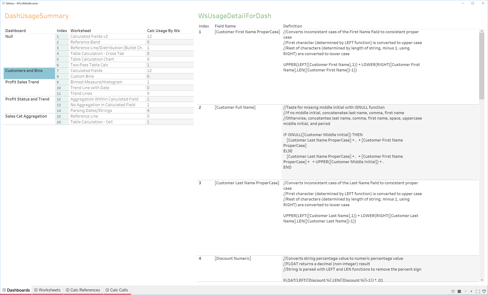

**BI Tool Meta Browser** (BMB) is a tool for examining the calculated field usage and dependencies of a Tableau workbook. Similar to how MS Visual Studio or other IDE's allow you to navigate the dependency tree of classes and methods or perform a find all references, BMB provides a Tableau-centric view of your own Tableau workbook which includes a handful of dashboards that present the same sort of information.

Rationale
---------

Tableau is a superior BI tool for analyzing and visualizing data. It makes it possible to program vast amounts of query logic in the form of **calculated fields** along-side a visual design surface. These fields can be used inside other fields or can be placed on different **sheets**. The sheets can then be combined inside **dashboards**. While these are great report authoring capabilities, Tableau does not provide an efficient way to examine the field definitions or where they are used across areas of the Tableau report or **workbook**.

### Example Calculated Field

For example, the Total Cost calculated field is show below. This can be found in a workbook called _Calculated Fields-Table Calculations-Statistics.twbx_ hosted on the following website: [http://www.tableaubook.com/v8/workbooks.asp](http://www.tableaubook.com/v8/workbooks.asp) An alternate version of this workbook with a number of dashboards added is used throughout this wiki. The combination of sheets added to the dashboards is not particularly important, but serves as a decent example for the BMB tool.

Notice that there are nine dependencies and they are not even all listed in the tool-tip pop-up. It says "... and 1 more", instead. Also, the ones shown are not actually click-able. Nor, can the user navigate to the definition of the Quantity or Unit Cost calculated fields which are used in the definition of the Total Cost field from within this window.

The full list of calculated fields can be found, of course, on the left-side pane of the user interface. Nonetheless, it is tedious and painful to click through each one to understand the full picture of calculated field usage and their definitions. Furthermore, Tableau only allows one field definition to be opened at a time.

Here is an additional view of the workbook. Many sheets are set to hidden, and one of the dashboards is showing–hiding all sheets is a common setting to use. In this case, Tableau does not show the calculated field list at all.

Basics of BI Tool Meta Browser (BMB)
------------------------------------

The BMB has two parts:

1.  Meta Browser Extractor (BiToolMetaBrowser.exe)
2.  Meta Browser Workbook (BiToolMetaBrowser.twb)

The extractor reads your Tableau workbook and creates a set of CSV files that contain calculated field information. The Meta Browser Workbook uses those CSV files as source data for displaying the field information in its dashboards.

### How to Run

The extractor executable can be run from a batch file or command line. Here is an example batch file:

The first argument is the path to your Tableau workbook. The second argument is the location of the Meta Browser Workbook or wherever you want to place the CSV files. You have to edit the source location for the CSV files in the browser workbook, of course.

The extractor will pop-up a console window and indicate which file is it extracting and how many times it has extracted. The extractor will listen for when you save the Tableau workbook and perform an extraction each time.

  

BMB Dashboards
--------------

Your Tableau workbook's calculated fields usage and dependencies are displayed across the following set of dashboards inside the Meta Browser Workbook.

### WsUsageDetailForDash

This first dashboard called _Dashboards_ shows a summary of dashboards and worksheets and how many calculated fields are used. The Dashboard and Worksheet can be clicked to display which field definitions they use on the right under _WsUsageDetailForDash_.

The next dashboard called _Worksheets_ is similar, but does not include the Dashboard category.

### Calc References

The _Calc References_ dashboard is shown below. It shows what fields call the selected field in the _CalcFieldSummary_ in the _CalcFieldCallers_ list on the top right. It also shows which worksheets contain the selected field in _CalcFieldWsUsers_ and the corresponding containing dashboards in _CalcFieldDashUsers_. Finally, the selected field's definition is displayed in the bottom right under _CalcFieldDetail_.

### Calc Calls

The _Calc Calls_ dashboard shown below displays the definitions of the fields in _CalcFieldUsageByCaller_ on the top right that are used in the selected field in the _CallerSummary_ on the left. The selected field's definition is also shown in _CallerFieldDetail_ on the bottom right.

Special Note about Differences between Tableau and BMB
------------------------------------------------------

Tableau will (try to) show in the tool-tip transitive (or downstream) dependencies. Whereas, BMB only lists direct dependencies, but could be upgraded in the future to include a full list of transitive dependencies. Currently, you can just click through each direct dependency to see them. For example, if looking at Total Cost in the _Calc References_ dashboards, it has a dependency on Retail Total and Profit. If you click on Retail Total, then the following view will show _Discounted Retail_ as a caller field:

Tableau will show _Discounted Retail_ in the dependencies list in the tool-tip to start with.

License
-------

Copyright 2019 M.C. Dean, Inc.

Licensed under the Apache License, Version 2.0 (the "License"); you may not use this file except in compliance with the License. You may obtain a copy of the License at

[http://www.apache.org/licenses/LICENSE-2.0](<http://www.apache.org/licenses/LICENSE-2.0>)

Unless required by applicable law or agreed to in writing, software distributed under the License is distributed on an "AS IS" BASIS, WITHOUT WARRANTIES OR CONDITIONS OF ANY KIND, either express or implied. See the License for the specific language governing permissions and limitations under the License.